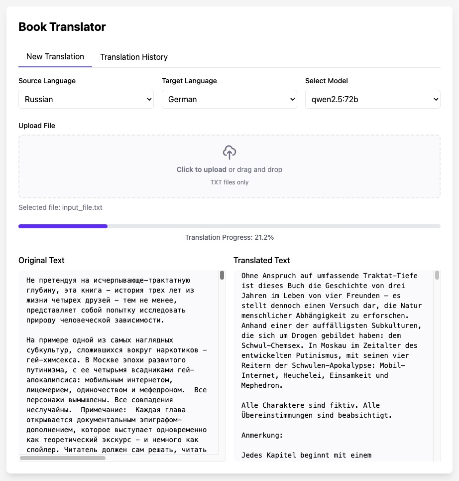

# Book Translator — Translate Books Offline with Ollama and Local LLMs

Upload a `.txt` file and get back a translation that a second AI pass has already reviewed and refined.

```bash
git clone https://github.com/KazKozDev/book-translator.git
cd book-translator
pip install -r requirements.txt
ollama pull gpt-oss:20b
python translator.py
```



Runs offline · No API keys · Open source

---

## Quick start

1. Make sure [Ollama](https://ollama.com/) is installed and running, and pull at least one model:

   ```bash
   ollama pull gpt-oss:20b
   ```

2. Install dependencies and start the app:

   ```bash
   pip install -r requirements.txt
   python translator.py
   ```

3. Open [http://localhost:5001](http://localhost:5001), pick source/target language and a model, upload a `.txt` or `.epub` file, open **Names & brief** and press *Propose from the source*, then press Start. Download the result once refinement finishes.

On macOS you can also run `./Launch\ Book-Translator.command`, which frees port `5001`, clears the translation cache, starts the server, and opens the browser for you.

## Translate books offline, with no API keys

Everything runs against your local Ollama server — no text leaves your machine and there's no API key or account to set up. That matters for manuscripts under NDA, personal documents, or just working without an internet connection. The trade-off is speed: translation quality and throughput depend entirely on the local model you choose and the hardware you run it on.

## Decide the names once, translate, then patch what is wrong

Everything after the upload is translated one ~1200-character chunk at a time. Proper-noun renderings are agreed before translation starts so they remain consistent throughout the book.

**Prepare** (optional, once per document) runs local [GLiNER multilingual NER](https://huggingface.co/urchade/gliner_multi-v2.1), unions the result with a capitalisation harvest so a name mentioned twice is not dropped by a frequency floor, and uses multilingual embeddings to cluster spelling variants. The configured general-instruct model then gets two passes: it rules on the clustering — confirming what the embeddings merged, splitting what they got wrong, deciding the ambiguous pairs — and then renders each candidate, in batches, with that candidate's own quoted context from wherever in the book it appears. It also picks the enforcement mode per term. A source form it proposes is accepted only if the document contains that form literally, so it can add a name the extractors missed and cannot invent one. The model weights download from Hugging Face once on the first Prepare run, then remain local and stay loaded between runs. The result is a proposal — canonical entity → aliases → target rendering — not “verified terminology”: review it and tick the approval box before Start.

**Translate** produces the draft, with the agreed renderings in the context of each chunk.

**Refine** does not rewrite the draft. It reports errors as located spans with a category and severity, Python applies the replacements and copies every other character through unchanged, and a second model has to agree the patch is more faithful to the source — twice, with the two versions swapped — before it is kept. Style-only and minor subjective findings are reported but never applied. A draft/final diff of a few percent is the expected result; a rewriting pass produced 20% and lost meaning doing it.

## How it works

```
upload → prepare: NER + recurring-entity clustering → names → split into chunks → translate → refine: estimate → patch → verify
       → cache (SQLite) → quality check → download / EPUB export
```

Flask serves the UI (`static/index.html`) and a small JSON API; every stage calls your local Ollama server. Chunk translations are cached in `cache.db` so re-running or resuming a job doesn't retranslate work already done, and job metadata/history live in `translations.db`.

## Quality Check

Run on demand from the panel, never automatically — several of these call a model again. Point the judge tests at a different model than the one that did the translating, or you are measuring with the ruler you cut with.

The tests that need no model read the **whole document**, which is the only way to catch the errors that live between chunks:

| Test | What it answers |
|---|---|
| Named-entity consistency | is every agreed rendering actually used in every chunk its name appears in (inflected forms count) |
| Numbers and dates | digit-written source facts that disappeared or changed in the final |
| Chunk coverage | missing, blank, or count-mismatched aligned final chunks |
| Untranslated words | which words are still in the source's script — a name that was never translated |
| Terminology delta | are exact glossary constraints satisfied, draft vs final |
| Length ratio | final against the **source**, which is where compression shows; final/draft is reported but tells you little |
| Diff ratio, repetition | how much refinement moved, and whether anything duplicated |
| LaBSE alignment | document-wide multilingual source/final alignment; flags semantic-drift outlier chunks |
| Target-language segments | multilingual Language ID flags untranslated or confidently wrong-language final chunks |

The model-based tests sample five chunks, chosen by risk (names, dialogue, numbers) rather than evenly spaced: adequacy and fluency for the draft and for the final — same prompt, same chunks, so the two numbers can be subtracted — a pairwise draft-vs-final judge that is shown the source and asked about accuracy separately from readability, COMET-Kiwi on either, and backtranslation chrF, which is marked diagnostic-only because a back-translation is not a reference.

There is no single score. Adequacy and fluency move in opposite directions when a refinement pass trades meaning for polish, and an average is precisely what hides that. The **Verdict** block shows each axis as draft → final and states the gates in words: an adequacy regression, a judge that prefers the draft on accuracy while preferring the final on readability, a missing name rendering, an unsatisfied glossary constraint.

LaBSE and Language ID are optional document-quality dependencies in `requirements-quality.txt`. The launcher offers to install them; their model weights download once on first use. XCOMET/MQM is intentionally not part of this first layer: run deterministic gates, LaBSE, and Language ID before adding a heavy quality evaluator.

## Configuration

| Setting | Default | Notes |
|---|---|---|
| Port | `5001` | override with the `PORT` environment variable |
| Ollama endpoint | `http://localhost:11434` | fixed, not currently configurable |
| Model | chosen in the UI | any model already pulled in Ollama |
| Languages | English, Russian, Spanish, French, German, Italian, Chinese, Japanese | selected per job |
| Genre | Unknown, Fiction, Technical, Academic, Business, Poetry | tunes the translation prompt |
| Chunk size | 1200 characters | paragraph-sized segments; text is split on paragraph, then sentence boundaries |

### TranslateGemma

`translategemma` (4B/12B/27B) is recognised by name and gets its own first-pass
prompt — the format its model card documents, plus this pipeline's genre,
glossary and previous-paragraph context folded in between the framing sentences
so the shape the model was trained on stays intact. Its own sampling settings
(`top_k 64`, `top_p 0.95`, stop `<end_of_turn>`) are sent explicitly, at a lower
temperature than general models get.

It is translation-only, so three things need a different model: Prepare, the
refinement pass (Continue), and the LLM-judge tests. All three are rejected with
an explanatory message if TranslateGemma is still selected. Backtranslation is
allowed — it is just the first pass run in reverse.

## Requirements

- Python 3.8+
- [Ollama](https://ollama.com/) installed and running locally
- At least one Ollama model pulled

## Limitations

- Input is `.txt` or `.epub` — no PDF or DOCX import. Output can be downloaded as `.txt` or exported as EPUB.
- Translation speed is bounded by your local model and hardware — a full book can take hours, not minutes.
- Refinement now costs three model calls per changed chunk (estimate, then two verification comparisons) instead of one rewrite, so it is slower than the old pass — and often correctly decides to change nothing.
- The refinement verifier is a local quantised model asked to compare two translations. It is a real gate, not a reliable one: on a measured run it accepted an edit that replaced a correct reading with a wrong one, and on the same text at a different temperature it rejected it. Treat a kept patch as "not obviously worse", not as "verified".
- Named-entity consistency matches on the stem so inflected forms count, which means it cannot tell two renderings apart when they differ only in the ending (Дурсль vs Дурсли). Such pairs are listed as needing a human eye rather than reported as clean.
- Translation quality hasn't been measured against a benchmark.
- The backend is a single Flask module (`translator.py`). `pytest tests/` covers the parts that need no model: proper-noun harvesting, span validation and patching, and the document-level checks.

<details>
<summary>Project layout</summary>

- `translator.py` — Flask app, translation pipeline, quality tests, SQLite persistence, caching, EPUB export, health/metrics endpoints
- `static/index.html` — browser UI for uploads, model/genre selection, the names editor, progress tracking, the Quality Check panel, and downloads
- `tests/` — the model-free half of the pipeline: `python -m pytest tests/`
- `uploads/`, `translations/`, `logs/` — runtime directories for uploaded files, exported output, and rotating logs
- `cache.db` — cached chunk translations; `translations.db` — job history and status

</details>

## License

MIT — see [LICENSE](LICENSE)

[Issues](https://github.com/KazKozDev/book-translator/issues) · [LinkedIn](https://www.linkedin.com/in/kazkozdev/)
