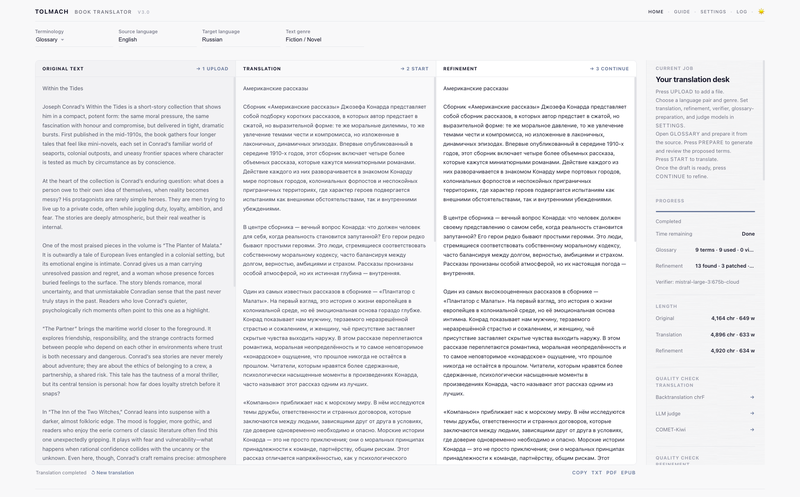
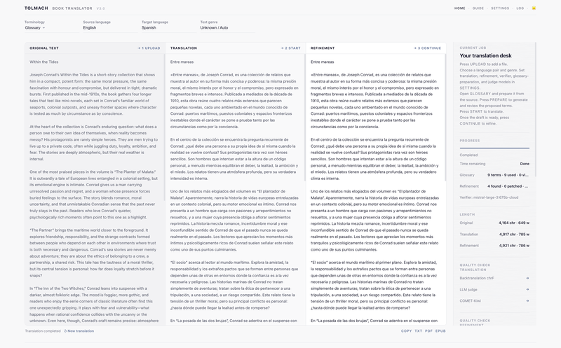
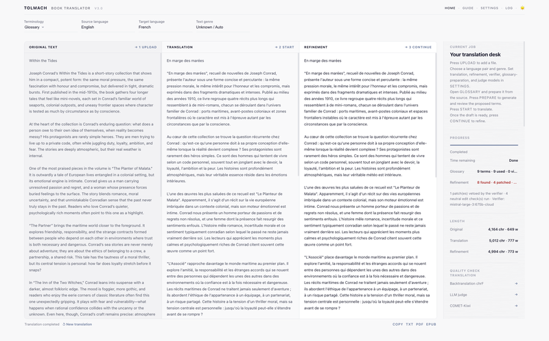
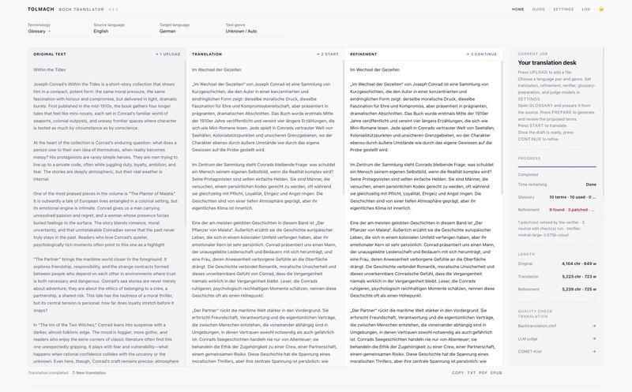
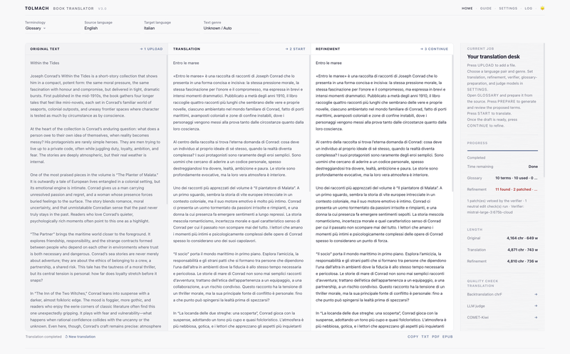
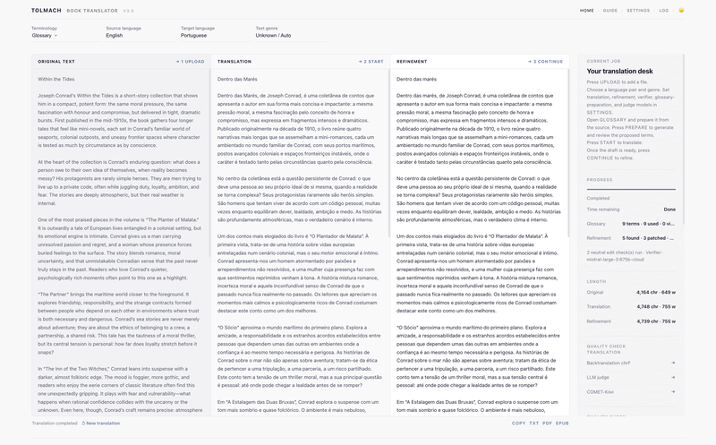
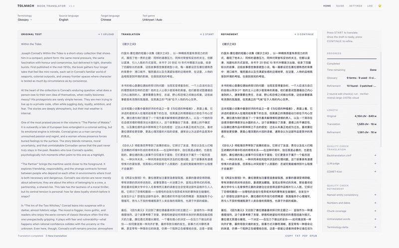
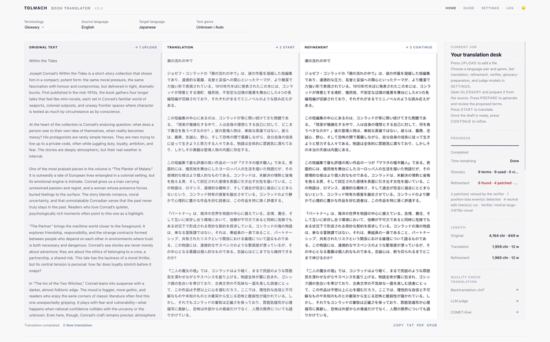
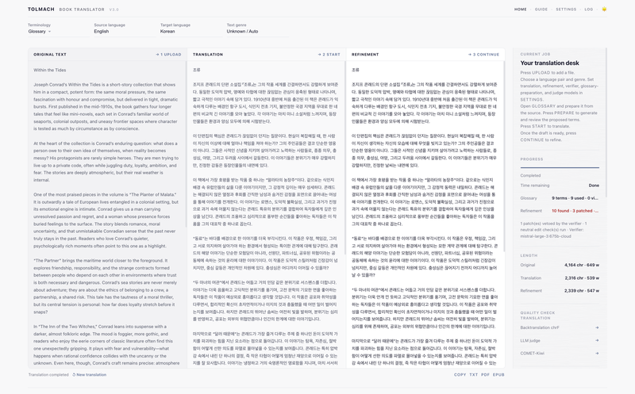

<h1 align="center">Tolmach — AI Book Translator</h1>

<p align="center">
  <b>Translate a whole novel on your own computer.</b><br>
  Open-source AI book translator powered by Ollama, with local models or Ollama Cloud.<br>
  Consistent names. Verified edits. Your text stays under your control.
</p>

<p align="center">
  EPUB · PDF · DOCX · TXT &nbsp;→&nbsp; a finished book in your language, ready to read.
</p>

<p align="center">
  <video src="https://github.com/user-attachments/assets/eae8eae5-6ca9-4b2c-8f67-cf7a39848794" controls muted playsinline width="820">
    Your browser does not support inline video.
    <a href="https://www.youtube.com/watch?v=-lMNAKOp1Kc" target="_blank" rel="noopener noreferrer">Watch on YouTube</a>
  </video>
</p>

---

## Get started in one command

```bash
# macOS / Linux
git clone https://github.com/KazKozDev/book-translator.git && cd book-translator && python3 launch.py
```

```bash
# Windows
git clone https://github.com/KazKozDev/book-translator.git
cd book-translator
py -3 launch.py
```

<p align="center">
  <a href="Launch%20Book-Translator.command"></a>
  <a href="Launch%20Book-Translator.bat"></a>
  <a href="Launch%20Book-Translator.sh"></a>
</p>

The launcher creates a virtual environment, installs dependencies, checks Ollama and models, starts Tolmach at `http://localhost:5001`, and opens your browser. Then pick a model per role in **Settings** and follow the numbered buttons.

---

## Chat translators break books

Paste a chapter into a chatbot and you get a decent page. Do it for 400 pages and the problems show up:

| Without Tolmach | With Tolmach |
|---|---|
| The hero's name changes between chapters | A glossary built from the whole book locks every name, place, and term |
| "Improve this" passes rewrite good wording | Only small, located edits — each checked against the source |
| Untranslated passages slip through | Source-language leftovers are detected and patched |
| You paste chunks, then reassemble by hand | Upload the book, download the book |
| Your manuscript goes to someone else's server | Runs on your computer with local Ollama models; cloud models only if you choose them |

---

## How the AI book translator works

```text
Upload → Prepare → Start → Continue → Review → Download
```

<table>
  <tr>
    <td width="33%" valign="top">
      <h3>1. Prepare</h3>
      Scans the entire book and proposes a glossary of characters, places, organisations, and terms. You approve it before anything is translated.
    </td>
    <td width="33%" valign="top">
      <h3>2. Start</h3>
      Translates in chunks with genre, glossary rules, and the previous paragraph as context. Finished sections appear while the rest keeps running.
    </td>
    <td width="33%" valign="top">
      <h3>3. Continue</h3>
      A refinement model proposes small edits. A separate verifier checks each one against the source before it touches the text.
    </td>
  </tr>
</table>

Then open the **Review desk**: source, first draft, and editable final text side by side. Export to **TXT, PDF, or EPUB**.

---

## Features

**Glossary that stays consistent**
- Built from the full book, with `exact`, `inflectable`, and `preferred` rules and `{notes}` the translator obeys
- **Shared glossary** carries approved entries across chapters of one novel
- **Copy frontier prompt** has an external model research the lore and write notes only where it is certain. Read them first: a wrong note is one the translator will obey

```text
Netherfield => Незерфилд | exact
Mr. Darcy   => мистер Дарси | inflectable
```

**Safe edits, full control**
- Only small, located edits, each verified against the source. Edits that leak source text or delete passages are rejected
- Review desk: source, draft, and editable final text side by side, with a *Needs review* filter and 2–3 alternatives on any passage
- Refinement mode: *auto-apply*, *suggest only*, or *skip*
- **Pause** at the next chunk boundary to free the GPU, **Resume** after a restart, reopen any job from the Archive
- Quality checks flag missing text, changed numbers, glossary violations, and repetition. They report, never rewrite

**Books in, books out**
- In: TXT, EPUB, PDF, DOCX. Out: TXT, PDF, EPUB
- PDF is read as text: running heads and page numbers removed, chapters from bookmarks or headings. Layout and images are not kept; scanned PDFs need OCR first
- DOCX keeps Heading 1 sections as chapters

**Private by design**
- The app, glossary, and job data run on `localhost` with SQLite
- **Local models** keep the book on your computer. **Ollama Cloud models** (the `-cloud` ones) send text to Ollama's servers, so use local models for sensitive manuscripts
- Optional cloud glossary verification sends only the glossary and language pair, never the book

---

## Translate EPUB and PDF books in 11 languages

Any of 11 languages as source or target: English, Russian, Spanish, French, German, Italian, Portuguese, Chinese, Japanese, Korean, and Turkish. Click a thumbnail for the full size.

<table>
  <tr>
    <td align="center"><a href="assets/locales/ru_RU.png"></a><br><code>ru_RU</code></td>
    <td align="center"><a href="assets/locales/es_ES.png"></a><br><code>es_ES</code></td>
    <td align="center"><a href="assets/locales/fr_FR.png"></a><br><code>fr_FR</code></td>
  </tr>
</table>

<details>
<summary>More screenshots</summary>

<table>
  <tr>
    <td align="center"><a href="assets/locales/de_DE.png"></a><br><code>de_DE</code></td>
    <td align="center"><a href="assets/locales/it_IT.png"></a><br><code>it_IT</code></td>
    <td align="center"><a href="assets/locales/pt_BR.png"></a><br><code>pt_BR</code></td>
  </tr>
  <tr>
    <td align="center"><a href="assets/locales/zh_CN.png"></a><br><code>zh_CN</code></td>
    <td align="center"><a href="assets/locales/ja_JP.png"></a><br><code>ja_JP</code></td>
    <td align="center"><a href="assets/locales/ko_KR.png"></a><br><code>ko_KR</code></td>
  </tr>
</table>

</details>

---

## What you need

- **Ollama** on the same computer, Python 3.10+ (installed via `uv` if missing), and enough memory and disk for your models
- **Minimum models:** `translategemma:12b` for translation plus `gemma4:31b` for the other roles
- **Author's stack** (cloud open-source models): Glossary and Refinement `gemma4:31b-cloud`, Translation `translategemma:27b`, Verifier and Judge `mistral-large-4:cloud`

---

## Honest expectations

- A full book takes **10–15 hours** on local hardware. This is a pipeline, not a chat reply.
- Quality depends on your models; smaller ones run with lower quality.
- Models can still miss errors. Proofread before you publish.

---

<details>
<summary><b>Under the hood</b></summary>

```text
Browser
   ↓
Flask UI + JSON API
   ↓
Prepare → Start → Continue → Review
   ↓         ↓         ↓
Glossary   Ollama   Verifier
   └───────── SQLite ─────────┘
                ↓
          TXT / PDF / EPUB
```

- **Prepare** — text harvesting and GLiNER collect candidates; BGE-M3 groups spelling variants; an instruct model proposes renderings.
- **Start** — chunks of about 1200 characters split at paragraph and sentence boundaries, streamed to SQLite and the browser.
- **Continue** — located edits, deterministic guards, verifier with position-bias retry.
- **Quality checks** — deterministic checks plus optional LLM judge, backtranslation chrF, LaBSE alignment, and COMET-Kiwi; wrong-language passages are flagged too.
- **Storage** — `translations.db` (jobs, chunks, glossary, review state), `cache.db` (chunk cache for resumes).

Key files: `launch.py`, `src/translator.py`, `src/terminology.py`, `src/quality_tests.py`, `src/epub_io.py`, `src/pdf_io.py`, `src/frontier_glossary.py`, `src/translation_cache.py`, `src/prompts/`, `tests/`.

</details>

<details>
<summary><b>Configuration</b></summary>

| Setting | Default | Meaning |
|---|---|---|
| App address | `http://localhost:5001` | Set `PORT` to change |
| Reachable from | This computer only | `HOST=0.0.0.0` opens it to your network (no login — trusted networks only) |
| Ollama address | `http://localhost:11434` | Local model server |
| Translation model | `translategemma:12b` preferred | Used by **START** |
| Glossary / Refinement | First suitable instruct model | Used by **PREPARE** / **CONTINUE** |
| Verifier | Different from Refinement | Checks proposed edits |
| Judge | Different from Translation | Optional diagnostics |
| Chunk size | `1200` characters | Paragraphs first, then sentences |
| Genre | Auto | Fiction, Technical, Academic, Business, Poetry |
| Glossary verification | Off | Set `OPENAI_API_KEY`, `ANTHROPIC_API_KEY`, or `GEMINI_API_KEY` |
| COMET-Kiwi | Off | Set `HF_TOKEN` after gated-model access |

</details>

<details>
<summary><b>Development</b></summary>

```bash
python3 -m venv .venv
source .venv/bin/activate
python -m pip install -r requirements-dev.txt
python -m pytest tests -q
ruff check .
```

Tests need no Ollama, models, or network.

</details>

---

## Contributors

[@StellarNear](https://github.com/StellarNear) ([#23](https://github.com/KazKozDev/book-translator/pull/23)) · [@kroryan](https://github.com/kroryan) ([#9](https://github.com/KazKozDev/book-translator/pull/9)) · [@moonixt](https://github.com/moonixt) ([#6](https://github.com/KazKozDev/book-translator/pull/6))

## License

[AGPL-3.0-only](LICENSE)

<br><br>

<p align="center">
  <a href="https://github.com/KazKozDev/book-translator/blob/main/LICENSE"></a>
  <a href="https://github.com/KazKozDev/book-translator/actions/workflows/ci.yml"></a>
  <a href="https://www.python.org/"></a>
</p>

<p align="center">
  <a href="https://github.com/KazKozDev/book-translator/issues">Issues</a> ·
  <a href="CHANGELOG.md">Changelog</a> ·
  <a href="CONTRIBUTING.md">Contributing</a> ·
  <a href="DISCLAIMER.md">Disclaimer</a> ·
  <a href="https://www.linkedin.com/in/kazkozdev/">LinkedIn</a>
</p>
